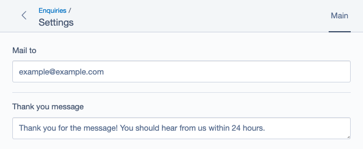

# Silverstripe  SomeConfig

If 🗂️ `ModelAdmin` and ⚙️ `SiteConfig` had a baby, what would you get? This module! 🐣

## What is this for

`SiteConfig` is great for storing site wide settings. `ModelAdmin` is great for viewing data. But you know what? Sometimes you want to co-locate related data and settings.

`SomeConfig` combines the CRUD features of `ModelAdmin` with the singleton settings editing of `SiteConfig`, so content and related settings can live together.

**Example:**

Say you have a contact form on every page of your site, and you have a `ModelAdmin` instance to let CMS users browse submissions. That contact form sends an email to someone, so you added an `EnquiryMailTo` field to `SiteConfig` for that. Now users have to go to two different places to manage content related to your enquiry form. Wouldn't it be nice if it was all under `/admin/enquiries/`?




## Requirements

SilverStripe ^4

## Installation

```sh
composer require jonom/silverstripe-someconfig
```

## How to use

1. Apply the `SomeConfig` trait to a `DataObject` class that contains your settings fields.
    * Like `SiteConfig`, only one of these objects will be allowed to exist per site.
    ```php
    use JonoM\SomeConfig\SomeConfig;
    use SilverStripe\ORM\DataObject;
    use SilverStripe\View\TemplateGlobalProvider;

    class EnquiryConfig extends DataObject implements TemplateGlobalProvider
    {
        use SomeConfig;

        private static $db = [
            'MailTo' => 'Varchar(255)',
            'ThankYouMessage' => 'Text',
        ];
    }
    ```
2. Apply the `SomeConfigAdmin` trait to a `ModelAdmin` sub-class that includes your config class.
    * _**Limitation:** your config class can't be first._ At this time this module is pretty simple. It just changes the tab and back links so you don't see the gridfield for your settings object. That trick doesn't work though if your settings class is the first tab as the gridfield view will be loaded when you access the admin.
    ```php
    use JonoM\SomeConfig\SomeConfigAdmin;
    use SilverStripe\Admin\ModelAdmin;

    class EnquiryAdmin extends ModelAdmin
    {
        use SomeConfigAdmin;

        private static $managed_models = [
            'EnquirySubmission',
            'EnquiryTopic',
            // Cannot be first
            'EnquiryConfig',
        ];

        private static $url_segment = 'enquiries';
        private static $menu_title = 'Enquiries';
        private static $menu_icon_class = 'font-icon-p-mail';
    }
    ```
3. If you want to access config settings in templates, make sure your config class implements `TemplateGlobalProvider`. Then use it like `SiteConfig`.
    ```html
    <a href="mailto:{$EnquiryConfig.MailTo}?subject=Contact%20Form$20Broke">Email us</a>
    ```
4. You can access config objects in php code like:
    ```php
    $email = EnquiryConfig::current_config()->MailTo
    ```

## Maintainer contact

[Jono Menz](https://jonomenz.com)

## Sponsorship

If you want to boost morale of the maintainer you're welcome to make a small monthly donation through [**GitHub**](https://github.com/sponsors/jonom), or a one time donation through [**PayPal**](https://www.paypal.com/cgi-bin/webscr?cmd=_s-xclick&hosted_button_id=Z5HEZREZSKA6A). ❤️ Thank you!

Please also feel free to [get in touch](https://jonomenz.com) if you want to hire the maintainer to develop a new feature, or discuss another opportunity.
